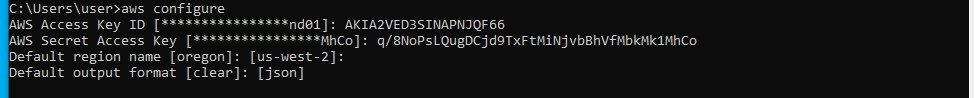
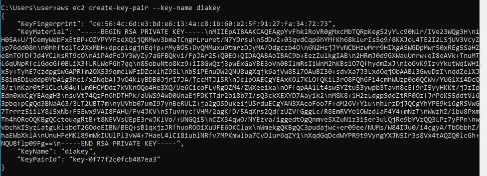
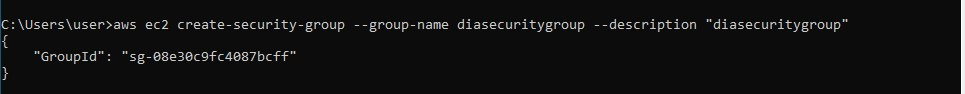
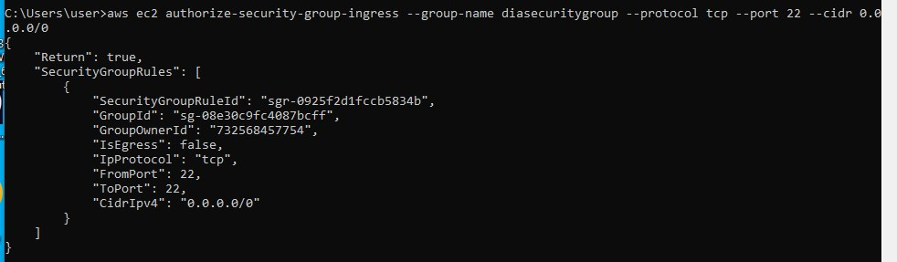
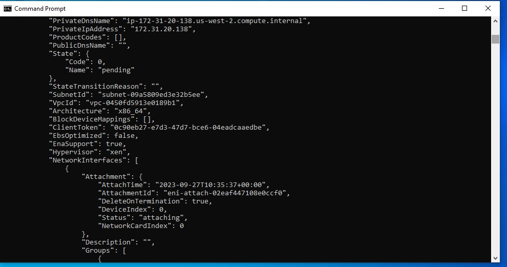

# LAUNCH AN EC2 USING AWS CLI
## Task 1; Access console via accesskeys
    step 1 : Type aws configure and press enter
    step 2 : type in your aws Access key ID and press enter
    step 3 : input your aws secret Access key and click enter
    step 4 : enter the region name from the aws management console and enter
    step 5 : input your output format json and click enter

## task 2; Create a key pair
    step 6: Input "aws ec2 create-key-pair --key-name<Kkeypair-Name> --query 'KeyMaterial' --output><keypair-name.pem>"
 

 ## task 3; Create a security group.
    step 7: input "aws ec2 create-security-group --group-name <security group Name> --description"<Description>" "
    

## task 4: Authorize security group.
    step 8; input "aws ec2 authorize-security-group ingress --group-name <security group name> --protocol tcp --port <port number> --cidr <IP address>"
  

## task 5: Launch Instances
    step 9; "aws ec2 run-instances-image-id<ami-id> --count 1 -- instance type- <type> --Keyname <Keypair-Name> --security-groups <security group Name>"
 

## task 6: view running instances
    step 10: input "aws ec2 describe-instances"

